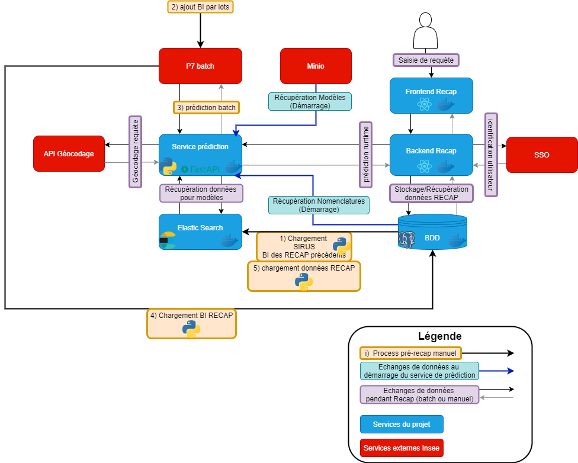

aiee2 Repo !
============

Annuaire des participants
-------------------------

| Organisme | Participant | rôle | mail |
| ---      |  ------  | -------- | ---------:|
| Insee   | Yves-Laurent Benichou   | chef de projet | Yves-laurent.benichou@insee.fr   |
|  | Elise Coudin | directrice SSP Lab | elise.coudin@insee.fr |
| | Jérémy L'Hour | Data Scientist, SSP Lab |  |
| | Julie Djiriguian | Data Scientist, SSP Lab |  |
| | Hugues Arnulf | Data Scientist alternant | |
| | Juliette Fourcot | Resp. Innovation Informatique |  |
| | Gwennaël Solard | Maîtrise d’ouvrage, Resp. division RP | Gwennael.solard@insee.fr |
| | Souheil Benmebkout | Division RP | Souheil.benmebkout@insee.fr |
| | Lucile Vanotti | Administratrice app RECAP, Division RP |  |
| EtaLab | Kim Montalibet | Data Scientist | kim.montalibet@data.gouv.fr |
| DITP | Hélène Boissin-Jonville | Analyse impact métiers | helene.boissinjonville@modernisation.gouv.fr |
| Starclay | Cyril Poulet | Pilote, Data Scientist Senior | cpoulet@starclay.fr |
| | Brivaël Sanchez | Data Scientist Junior | bsanchez@starclay.fr |
| | Virgile Junique | Profil technique (data ou front) |  |

Service Elastic Search
----------------------

Contenu du projet
-----------------

- **communes** : reprise nom et code communes

- **data_import** : scripts d'import de données CSV -> PostgreSQL et classe **PostGre_SQL_DB** de connexion à la base PostgreSQL utilisée dans le reste du projet

- **dictionnaire** : dictionnaires des données

- **documentation** : génération automatique de la documentation :
    - *documentation/source* : fichiers de config / description
    - *documentation/build* : dossier de génération de la doc

- **elasticsearch** : Ressources ES (contrats, requètes, scripts de chargement des données)

- **mef_data** : mise en forme des données (conversion sas -> csv, split, geocod ...) 

- **nomenclatures** : code relatif à la pipeline d'entrainement des modèles de codage des nomenclatures NAF et PCS

- **pipeline_bi_noncodable** : code relatif à la pipeline d'entrainement du modèle de détection des BI non codables

- **pipeline_siret_bi**: code relatif à la pipeline d'entrainement du modèle de codage SIRET

- **service_prediction**: code relatif au service de prédiction proposant la mise a disposition via api de l'ensemble des modèles du projet.

- **service_prediction/script_autocode_bis.py**: script de codage automatique des BIs via appel du service de prédiction (remplacement très simplifié des appels MCA/Sicore)

Etapes d'une campagne RECAP
---------------------------

L'architecture déployée est celle-ci : 

Pour une nouvelle campagne, les étapes sont (globalement):

1. Entrainement
    - Mettre dans la base postgreSQL les données de sirus et les données des BIs codés de l'année précédente
    - entraîner les différents modèles (voir les dossiers)
    - publier les modèles sur minio

2. Recap Batch
    - Mettre dans la base les données Sirus et les données BI de la nouvelle campagne (ou une partie des BI)
    - appliquer les différents modèles sur les BIs
        - codage auto
        - naf + pcs
        - geocodage
    - stocker le résultat dans la base, et les verser dans ES
    - appliquer le modèle Siret + codage auto
    - stocker le résultat dans la base
    - créer les lots/vagues RECAP à partir des BI considérés "codables" mais non codés automatiquement par le modèle pcs ou le modèle Siret

Ce fonctionnement est "optimal" mais il n'est pas nécessaire de tout précalculer. On peut aussi juste déployer les modèles dans le service de prédiction, et RECAP batch se contente de l'appeler pour obtenir les données dont elle a besoin. En revanche ces étapes devront être faites avant la campagne RECAP manuelle sur les BIs des vagues créées a minima, sur tous les BI de préférence (renforcement de l'historique)

3. Recap manuel
    - à ce stade les données BI doivent être enrichies et précalculés, stockées dans la base, puis dans ES
    - on déploie le service de prédiction sur les tables concernées
    - on démarre la campagne. 

IMPORTANT: se réferer au document décrivant la procédure d'initialisation d'une campagne p7.

Utilisation de Fasttext
-----------------------

IMPORTANT: de nombreux modèles utilisent des embeddings fasttext, dont on change les dimensions au besoin.
Après diverses investigations, il s'avère que:
- le modèle 'de base' téléchargeable via la lib est "cc.fr.300.bin", de taille 300
- sa taille est changeable via fasttext/reduce_model.py
- cependant, cela ne fonctionne que sur un modèle cc.fr.300.bin tout juste téléchargé via fasttext
- un modèle (resizé ou non) stocké sur minio n'a aucun problème pour être chargé et utilisé, MAIS toute tentative de le resizer à ce moment échouera (je ne sais pas pourquoi)

Il est donc conseillé de faire download/resize puis stockage sur minio, puis récupération du modèle resizé sur minio.

Autre point: le modèle de base est gros (~18Go), et le resize nécessite quasi autant de place supplémentaire.
Il faut donc prévoir au moins 40Go de RAM pour une opération de reduce_model...

Documentation
------------------------

- Générer la documentation
    1. Installer sphinx

        pip3 install --upgrade -r documentation/requirements_doc.txt

    2. Générer la doc

        cd documentation && make html

- Ajouter de la documentation
    1.  Si ajout d'un nouveau package, utiliser sphinx-apidoc qui va générer des fichiers .rst
    2.  Sinon : écrire soi-même le fichier rst
    3.  L'intégrer dans la documentation actuelle, dans documentation/source

